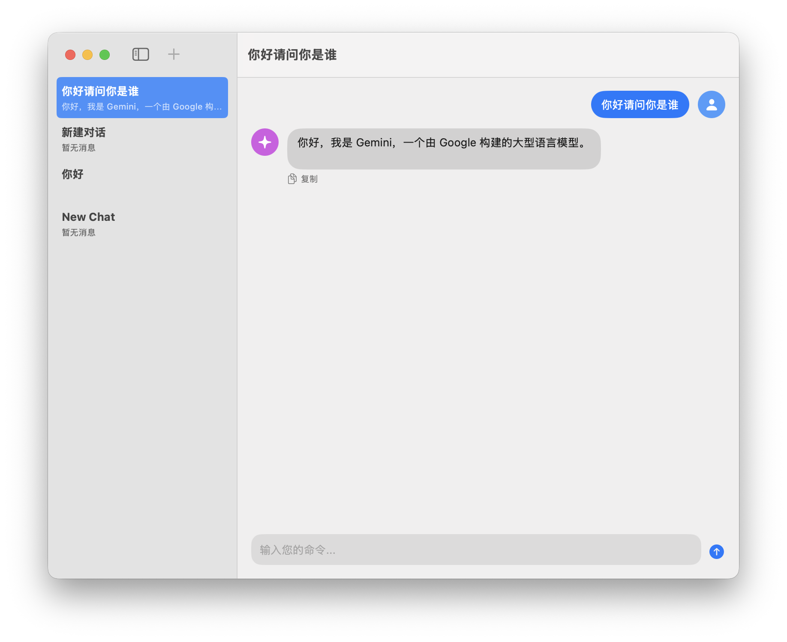

# Gemini GUI

 <!-- Placeholder for a screenshot -->

A native macOS Graphical User Interface (GUI) for interacting with the Gemini Command Line Interface (CLI). This application provides a user-friendly chat interface to leverage the power of Gemini directly from your desktop.

## Features

*   **Interactive Chat Interface:** Send prompts and receive responses from Gemini.
*   **Conversation History:** All your conversations are automatically saved and loaded, accessible via a sidebar.
*   **Multi-Conversation Support:** Create, manage, and switch between multiple chat sessions.
*   **Customizable Avatars:** Personalize your user and Gemini avatars using SF Symbols.
*   **Haptic Feedback:** Get subtle haptic feedback on your MacBook's trackpad when Gemini starts typing (toggleable in settings).
*   **Typing Indicator:** See a visual indicator when Gemini is generating a response.
*   **Stop Generation:** Interrupt ongoing responses from Gemini.
*   **Copy Messages:** Easily copy Gemini's responses to your clipboard.
*   **Enter to Send:** Send messages by pressing the Enter key.
*   **Customizable Gemini CLI Path:** Configure the path to your `gemini` executable in the application settings.
*   **Localization:** Supports multiple languages (English, Simplified Chinese) based on system settings.

## Requirements

*   macOS (latest version recommended)
*   Xcode (latest stable version recommended)
*   [Gemini CLI](https://github.com/google/gemini-cli) installed and configured on your system.

## Installation & Setup

1.  **Clone the repository:**
    ```bash
    git clone https://github.com/H7ang0/GeminiGUI.git # Replace with your actual repo URL
    cd GeminiGUI
    ```
2.  **Open in Xcode:**
    Open the `GeminiGUI.xcodeproj` file in Xcode.
3.  **Disable App Sandbox:**
    *   In Xcode, select your project `GeminiGUI` in the left navigator.
    *   In the main editor area, select your target `GeminiGUI`.
    *   Go to the **Signing & Capabilities** tab.
    *   Find **App Sandbox** and click the `x` (remove) button next to it. This is necessary for the app to execute the `gemini` CLI outside its sandbox.
4.  **Build and Run:**
    Build and run the project (`Cmd + R`).
5.  **Configure Gemini CLI Path:**
    *   Once the app launches, go to `GeminiGUI` (in the macOS menu bar) -> `Settings...`.
    *   In the "General" section, enter the full path to your `gemini` executable (e.g., `/opt/homebrew/bin/gemini`). You can find this path by typing `which gemini` in your terminal.
    *   (Optional) Customize your avatars and haptic feedback settings.

## Usage

*   **New Chat:** Click the `+` button in the sidebar to start a new conversation.
*   **Select Chat:** Click on any conversation in the sidebar to view its history.
*   **Send Message:** Type your prompt in the input field at the bottom and press Enter or click the send button.
*   **Stop:** Click the red stop button to interrupt Gemini's response.
*   **Copy:** Click the copy button next to Gemini's messages to copy the text.

## Localization

The application supports:
*   English
*   Simplified Chinese (简体中文)

The language will automatically follow your macOS system language settings.

## Credits

Developed by [H7ang0](https://t.me/H7ang0)

## License

This project is open-source and available under the [MIT License](LICENSE). <!-- Suggest adding a LICENSE file -->
